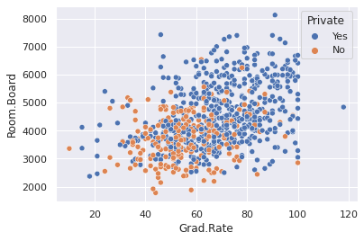
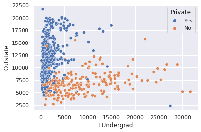
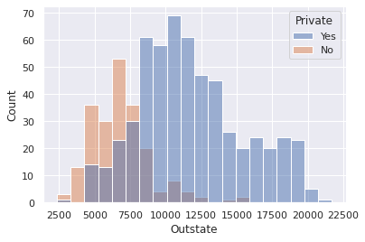
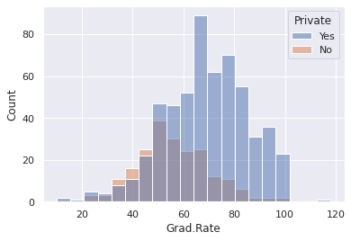

<h1 style="font-size:50px;">K Means Clustering</h1><hr>

K Means Clustering is an unsupervised machine learning algorithm, in which the unlabeled data is clustered together into groups. How is this done? First we plot the data into a scatterplot, then we attempt to find K points(centroids) such that the various points in all the groups are closest it. Accordingly we group the points into K clusters.<br>Hence, this algorithm is called as K Means Clustering.


<h2>Dataset</h2><br>To demonstrate K Means Clustering, we will work with a dataset of various Universities and cluster them into <b>Private</b> or <b>Public</b>
<br><h2>Importing the libraries and fetching data</h2>


```python
import pandas as pd
import numpy as np
import matplotlib.pyplot as plt
import seaborn as sns
%matplotlib inline
```


```python
df = pd.read_csv('College_Data',index_col=0)
```


```python
df.info()
```

    <class 'pandas.core.frame.DataFrame'>
    Index: 777 entries, Abilene Christian University to York College of Pennsylvania
    Data columns (total 18 columns):
     #   Column       Non-Null Count  Dtype  
    ---  ------       --------------  -----  
     0   Private      777 non-null    object 
     1   Apps         777 non-null    int64  
     2   Accept       777 non-null    int64  
     3   Enroll       777 non-null    int64  
     4   Top10perc    777 non-null    int64  
     5   Top25perc    777 non-null    int64  
     6   F.Undergrad  777 non-null    int64  
     7   P.Undergrad  777 non-null    int64  
     8   Outstate     777 non-null    int64  
     9   Room.Board   777 non-null    int64  
     10  Books        777 non-null    int64  
     11  Personal     777 non-null    int64  
     12  PhD          777 non-null    int64  
     13  Terminal     777 non-null    int64  
     14  S.F.Ratio    777 non-null    float64
     15  perc.alumni  777 non-null    int64  
     16  Expend       777 non-null    int64  
     17  Grad.Rate    777 non-null    int64  
    dtypes: float64(1), int64(16), object(1)
    memory usage: 115.3+ KB


```python
df.describe()
```


<div>
<style scoped>
    .dataframe tbody tr th:only-of-type {
        vertical-align: middle;
    }

    .dataframe tbody tr th {
        vertical-align: top;
    }

    .dataframe thead th {
        text-align: right;
    }
</style>
<table border="1" class="dataframe">
  <thead>
    <tr style="text-align: right;">
      <th></th>
      <th>Apps</th>
      <th>Accept</th>
      <th>Enroll</th>
      <th>Top10perc</th>
      <th>Top25perc</th>
      <th>F.Undergrad</th>
      <th>P.Undergrad</th>
      <th>Outstate</th>
      <th>Room.Board</th>
      <th>Books</th>
      <th>Personal</th>
      <th>PhD</th>
      <th>Terminal</th>
      <th>S.F.Ratio</th>
      <th>perc.alumni</th>
      <th>Expend</th>
      <th>Grad.Rate</th>
    </tr>
  </thead>
  <tbody>
    <tr>
      <th>count</th>
      <td>777.000000</td>
      <td>777.000000</td>
      <td>777.000000</td>
      <td>777.000000</td>
      <td>777.000000</td>
      <td>777.000000</td>
      <td>777.000000</td>
      <td>777.000000</td>
      <td>777.000000</td>
      <td>777.000000</td>
      <td>777.000000</td>
      <td>777.000000</td>
      <td>777.000000</td>
      <td>777.000000</td>
      <td>777.000000</td>
      <td>777.000000</td>
      <td>777.00000</td>
    </tr>
    <tr>
      <th>mean</th>
      <td>3001.638353</td>
      <td>2018.804376</td>
      <td>779.972973</td>
      <td>27.558559</td>
      <td>55.796654</td>
      <td>3699.907336</td>
      <td>855.298584</td>
      <td>10440.669241</td>
      <td>4357.526384</td>
      <td>549.380952</td>
      <td>1340.642214</td>
      <td>72.660232</td>
      <td>79.702703</td>
      <td>14.089704</td>
      <td>22.743887</td>
      <td>9660.171171</td>
      <td>65.46332</td>
    </tr>
    <tr>
      <th>std</th>
      <td>3870.201484</td>
      <td>2451.113971</td>
      <td>929.176190</td>
      <td>17.640364</td>
      <td>19.804778</td>
      <td>4850.420531</td>
      <td>1522.431887</td>
      <td>4023.016484</td>
      <td>1096.696416</td>
      <td>165.105360</td>
      <td>677.071454</td>
      <td>16.328155</td>
      <td>14.722359</td>
      <td>3.958349</td>
      <td>12.391801</td>
      <td>5221.768440</td>
      <td>17.17771</td>
    </tr>
    <tr>
      <th>min</th>
      <td>81.000000</td>
      <td>72.000000</td>
      <td>35.000000</td>
      <td>1.000000</td>
      <td>9.000000</td>
      <td>139.000000</td>
      <td>1.000000</td>
      <td>2340.000000</td>
      <td>1780.000000</td>
      <td>96.000000</td>
      <td>250.000000</td>
      <td>8.000000</td>
      <td>24.000000</td>
      <td>2.500000</td>
      <td>0.000000</td>
      <td>3186.000000</td>
      <td>10.00000</td>
    </tr>
    <tr>
      <th>25%</th>
      <td>776.000000</td>
      <td>604.000000</td>
      <td>242.000000</td>
      <td>15.000000</td>
      <td>41.000000</td>
      <td>992.000000</td>
      <td>95.000000</td>
      <td>7320.000000</td>
      <td>3597.000000</td>
      <td>470.000000</td>
      <td>850.000000</td>
      <td>62.000000</td>
      <td>71.000000</td>
      <td>11.500000</td>
      <td>13.000000</td>
      <td>6751.000000</td>
      <td>53.00000</td>
    </tr>
    <tr>
      <th>50%</th>
      <td>1558.000000</td>
      <td>1110.000000</td>
      <td>434.000000</td>
      <td>23.000000</td>
      <td>54.000000</td>
      <td>1707.000000</td>
      <td>353.000000</td>
      <td>9990.000000</td>
      <td>4200.000000</td>
      <td>500.000000</td>
      <td>1200.000000</td>
      <td>75.000000</td>
      <td>82.000000</td>
      <td>13.600000</td>
      <td>21.000000</td>
      <td>8377.000000</td>
      <td>65.00000</td>
    </tr>
    <tr>
      <th>75%</th>
      <td>3624.000000</td>
      <td>2424.000000</td>
      <td>902.000000</td>
      <td>35.000000</td>
      <td>69.000000</td>
      <td>4005.000000</td>
      <td>967.000000</td>
      <td>12925.000000</td>
      <td>5050.000000</td>
      <td>600.000000</td>
      <td>1700.000000</td>
      <td>85.000000</td>
      <td>92.000000</td>
      <td>16.500000</td>
      <td>31.000000</td>
      <td>10830.000000</td>
      <td>78.00000</td>
    </tr>
    <tr>
      <th>max</th>
      <td>48094.000000</td>
      <td>26330.000000</td>
      <td>6392.000000</td>
      <td>96.000000</td>
      <td>100.000000</td>
      <td>31643.000000</td>
      <td>21836.000000</td>
      <td>21700.000000</td>
      <td>8124.000000</td>
      <td>2340.000000</td>
      <td>6800.000000</td>
      <td>103.000000</td>
      <td>100.000000</td>
      <td>39.800000</td>
      <td>64.000000</td>
      <td>56233.000000</td>
      <td>118.00000</td>
    </tr>
  </tbody>
</table>
</div>


```python
df.head()
```


<div>
<style scoped>
    .dataframe tbody tr th:only-of-type {
        vertical-align: middle;
    }

    .dataframe tbody tr th {
        vertical-align: top;
    }

    .dataframe thead th {
        text-align: right;
    }
</style>
<table border="1" class="dataframe">
  <thead>
    <tr style="text-align: right;">
      <th></th>
      <th>Private</th>
      <th>Apps</th>
      <th>Accept</th>
      <th>Enroll</th>
      <th>Top10perc</th>
      <th>Top25perc</th>
      <th>F.Undergrad</th>
      <th>P.Undergrad</th>
      <th>Outstate</th>
      <th>Room.Board</th>
      <th>Books</th>
      <th>Personal</th>
      <th>PhD</th>
      <th>Terminal</th>
      <th>S.F.Ratio</th>
      <th>perc.alumni</th>
      <th>Expend</th>
      <th>Grad.Rate</th>
    </tr>
  </thead>
  <tbody>
    <tr>
      <th>Abilene Christian University</th>
      <td>Yes</td>
      <td>1660</td>
      <td>1232</td>
      <td>721</td>
      <td>23</td>
      <td>52</td>
      <td>2885</td>
      <td>537</td>
      <td>7440</td>
      <td>3300</td>
      <td>450</td>
      <td>2200</td>
      <td>70</td>
      <td>78</td>
      <td>18.1</td>
      <td>12</td>
      <td>7041</td>
      <td>60</td>
    </tr>
    <tr>
      <th>Adelphi University</th>
      <td>Yes</td>
      <td>2186</td>
      <td>1924</td>
      <td>512</td>
      <td>16</td>
      <td>29</td>
      <td>2683</td>
      <td>1227</td>
      <td>12280</td>
      <td>6450</td>
      <td>750</td>
      <td>1500</td>
      <td>29</td>
      <td>30</td>
      <td>12.2</td>
      <td>16</td>
      <td>10527</td>
      <td>56</td>
    </tr>
    <tr>
      <th>Adrian College</th>
      <td>Yes</td>
      <td>1428</td>
      <td>1097</td>
      <td>336</td>
      <td>22</td>
      <td>50</td>
      <td>1036</td>
      <td>99</td>
      <td>11250</td>
      <td>3750</td>
      <td>400</td>
      <td>1165</td>
      <td>53</td>
      <td>66</td>
      <td>12.9</td>
      <td>30</td>
      <td>8735</td>
      <td>54</td>
    </tr>
    <tr>
      <th>Agnes Scott College</th>
      <td>Yes</td>
      <td>417</td>
      <td>349</td>
      <td>137</td>
      <td>60</td>
      <td>89</td>
      <td>510</td>
      <td>63</td>
      <td>12960</td>
      <td>5450</td>
      <td>450</td>
      <td>875</td>
      <td>92</td>
      <td>97</td>
      <td>7.7</td>
      <td>37</td>
      <td>19016</td>
      <td>59</td>
    </tr>
    <tr>
      <th>Alaska Pacific University</th>
      <td>Yes</td>
      <td>193</td>
      <td>146</td>
      <td>55</td>
      <td>16</td>
      <td>44</td>
      <td>249</td>
      <td>869</td>
      <td>7560</td>
      <td>4120</td>
      <td>800</td>
      <td>1500</td>
      <td>76</td>
      <td>72</td>
      <td>11.9</td>
      <td>2</td>
      <td>10922</td>
      <td>15</td>
    </tr>
  </tbody>
</table>
</div>


<h2>Data Visualisation</h2><br><b>Scatterplot of Grad.Rate versus Room.Board grouped by Public or Private<b>


```python
sns.set_theme(style="darkgrid")
sns.scatterplot(data=df,x="Grad.Rate",y="Room.Board",hue="Private")
```


    <AxesSubplot:xlabel='Grad.Rate', ylabel='Room.Board'>


    

    


<b>Scatterplot of F.Undergrad versus Outstate grouped by Public or Private</b>


```python
sns.scatterplot(data=df,x="F.Undergrad",y="Outstate",hue="Private")
```


    <AxesSubplot:xlabel='F.Undergrad', ylabel='Outstate'>


    

    


<b>Stacked histogram showing Out of State Tuition based on the Private column.</b>


```python
sns.histplot(data=df,x="Outstate",hue="Private",bins=20)
```


    <AxesSubplot:xlabel='Outstate', ylabel='Count'>


    

    


<b>Stacked histogram showing Grad.Rate based on the Private column.</b>


```python
sns.histplot(data=df,x="Grad.Rate",hue="Private",bins=20)
```


    <AxesSubplot:xlabel='Grad.Rate', ylabel='Count'>


    

    


Wait. Is there any college with a graduation rate higher than 100%?


```python
df[df['Grad.Rate'] > 100]
```


<div>
<style scoped>
    .dataframe tbody tr th:only-of-type {
        vertical-align: middle;
    }

    .dataframe tbody tr th {
        vertical-align: top;
    }

    .dataframe thead th {
        text-align: right;
    }
</style>
<table border="1" class="dataframe">
  <thead>
    <tr style="text-align: right;">
      <th></th>
      <th>Unnamed: 0</th>
      <th>Private</th>
      <th>Apps</th>
      <th>Accept</th>
      <th>Enroll</th>
      <th>Top10perc</th>
      <th>Top25perc</th>
      <th>F.Undergrad</th>
      <th>P.Undergrad</th>
      <th>Outstate</th>
      <th>Room.Board</th>
      <th>Books</th>
      <th>Personal</th>
      <th>PhD</th>
      <th>Terminal</th>
      <th>S.F.Ratio</th>
      <th>perc.alumni</th>
      <th>Expend</th>
      <th>Grad.Rate</th>
    </tr>
  </thead>
  <tbody>
    <tr>
      <th>95</th>
      <td>Cazenovia College</td>
      <td>Yes</td>
      <td>3847</td>
      <td>3433</td>
      <td>527</td>
      <td>9</td>
      <td>35</td>
      <td>1010</td>
      <td>12</td>
      <td>9384</td>
      <td>4840</td>
      <td>600</td>
      <td>500</td>
      <td>22</td>
      <td>47</td>
      <td>14.3</td>
      <td>20</td>
      <td>7697</td>
      <td>118</td>
    </tr>
  </tbody>
</table>
</div>


Lets fix that.


```python
df = df[df['Grad.Rate'] <= 100]
```


```python
df[df['Grad.Rate'] > 100]
```


<div>
<style scoped>
    .dataframe tbody tr th:only-of-type {
        vertical-align: middle;
    }

    .dataframe tbody tr th {
        vertical-align: top;
    }

    .dataframe thead th {
        text-align: right;
    }
</style>
<table border="1" class="dataframe">
  <thead>
    <tr style="text-align: right;">
      <th></th>
      <th>Private</th>
      <th>Apps</th>
      <th>Accept</th>
      <th>Enroll</th>
      <th>Top10perc</th>
      <th>Top25perc</th>
      <th>F.Undergrad</th>
      <th>P.Undergrad</th>
      <th>Outstate</th>
      <th>Room.Board</th>
      <th>Books</th>
      <th>Personal</th>
      <th>PhD</th>
      <th>Terminal</th>
      <th>S.F.Ratio</th>
      <th>perc.alumni</th>
      <th>Expend</th>
      <th>Grad.Rate</th>
    </tr>
  </thead>
  <tbody>
  </tbody>
</table>
</div>


<h2>Creating and evaluating the model</h2>


```python
from sklearn.cluster import KMeans
```


```python
kmeans = KMeans(n_clusters=2)
```


```python
df_fit = df.drop("Private",axis=1)
```


```python
kmeans.fit(df_fit)
```


    KMeans(n_clusters=2)


```python
kmeans.cluster_centers_
```


    array([[1.03631389e+04, 6.55089815e+03, 2.56972222e+03, 4.14907407e+01,
            7.02037037e+01, 1.30619352e+04, 2.46486111e+03, 1.07191759e+04,
            4.64347222e+03, 5.95212963e+02, 1.71420370e+03, 8.63981481e+01,
            9.13333333e+01, 1.40277778e+01, 2.00740741e+01, 1.41705000e+04,
            6.75925926e+01],
           [1.81019012e+03, 1.28395359e+03, 4.90991018e+02, 2.53338323e+01,
            5.34985030e+01, 2.19031287e+03, 5.96332335e+02, 1.03972231e+04,
            4.31057335e+03, 5.41895210e+02, 1.28150449e+03, 7.05149701e+01,
            7.78712575e+01, 1.40994012e+01, 2.31796407e+01, 8.93389521e+03,
            6.50404192e+01]])


<h2>Model Evalution</h2>


```python
Cluster = [1 if x == "Yes" else 0 for x in df["Private"]]
Cluster
```


    [1,
     1,
     1,
     1,
     1,
     1,
     1,
     1,
     1,
     1,
     1,
     1,
     1,
     1,
     1,
     1,
     1,
     1,
     1,
     0,
     1,
     0,
     1,
     0,
     1,
     0,
     1,
     0,
     1,
     1,
     1,
     1,
     1,
     1,
     1,
     1,
     1,
     1,
     1,
     1,
     1,
     1,
     1,
     1,
     1,
     0,
     1,
     1,
     1,
     1,
     1,
     1,
     1,
     1,
     1,
     1,
     0,
     1,
     1,
     1,
     1,
     0,
     1,
     1,
     1,
     1,
     1,
     1,
     1,
     1,
     1,
     1,
     1,
     1,
     1,
     1,
     1,
     1,
     0,
     0,
     1,
     1,
     1,
     1,
     1,
     1,
     1,
     1,
     1,
     1,
     1,
     1,
     0,
     1,
     1,
     1,
     1,
     1,
     1,
     1,
     1,
     0,
     0,
     0,
     1,
     1,
     1,
     1,
     1,
     1,
     1,
     0,
     1,
     1,
     1,
     1,
     1,
     0,
     0,
     1,
     1,
     1,
     1,
     1,
     0,
     1,
     1,
     1,
     1,
     1,
     1,
     1,
     1,
     1,
     1,
     1,
     1,
     0,
     1,
     1,
     0,
     1,
     1,
     1,
     1,
     1,
     1,
     1,
     1,
     1,
     1,
     1,
     1,
     1,
     1,
     1,
     1,
     1,
     1,
     1,
     0,
     1,
     1,
     1,
     0,
     1,
     1,
     1,
     1,
     1,
     1,
     1,
     1,
     1,
     1,
     0,
     0,
     1,
     1,
     0,
     0,
     1,
     1,
     1,
     1,
     1,
     1,
     1,
     1,
     1,
     1,
     0,
     1,
     1,
     0,
     1,
     0,
     1,
     1,
     1,
     0,
     1,
     0,
     1,
     1,
     0,
     0,
     1,
     1,
     1,
     1,
     1,
     1,
     1,
     1,
     1,
     1,
     0,
     1,
     1,
     1,
     0,
     0,
     1,
     1,
     1,
     1,
     1,
     1,
     1,
     1,
     1,
     0,
     1,
     1,
     1,
     1,
     1,
     1,
     1,
     1,
     1,
     1,
     1,
     1,
     1,
     1,
     1,
     1,
     1,
     1,
     1,
     1,
     1,
     1,
     1,
     1,
     1,
     1,
     1,
     1,
     1,
     1,
     1,
     1,
     1,
     1,
     1,
     0,
     1,
     1,
     1,
     0,
     0,
     1,
     1,
     0,
     1,
     0,
     1,
     0,
     1,
     1,
     1,
     0,
     1,
     1,
     0,
     1,
     0,
     1,
     1,
     1,
     1,
     1,
     1,
     1,
     1,
     1,
     1,
     1,
     1,
     0,
     1,
     0,
     1,
     1,
     1,
     1,
     1,
     1,
     1,
     1,
     1,
     1,
     0,
     1,
     1,
     1,
     0,
     0,
     1,
     1,
     0,
     0,
     1,
     1,
     1,
     1,
     1,
     1,
     1,
     0,
     1,
     1,
     1,
     1,
     1,
     1,
     0,
     1,
     1,
     1,
     1,
     1,
     1,
     0,
     1,
     1,
     1,
     1,
     1,
     1,
     1,
     0,
     1,
     1,
     1,
     1,
     1,
     1,
     1,
     0,
     1,
     0,
     0,
     0,
     1,
     0,
     1,
     1,
     1,
     1,
     1,
     0,
     0,
     0,
     1,
     1,
     1,
     0,
     0,
     0,
     1,
     0,
     1,
     1,
     1,
     1,
     1,
     1,
     1,
     1,
     1,
     1,
     1,
     1,
     1,
     1,
     1,
     0,
     1,
     1,
     1,
     0,
     0,
     1,
     1,
     1,
     0,
     0,
     0,
     1,
     1,
     0,
     1,
     0,
     1,
     0,
     0,
     0,
     1,
     1,
     1,
     1,
     1,
     0,
     1,
     1,
     1,
     1,
     0,
     1,
     1,
     1,
     0,
     1,
     1,
     1,
     1,
     1,
     1,
     1,
     0,
     0,
     1,
     0,
     1,
     1,
     1,
     1,
     1,
     1,
     1,
     1,
     1,
     0,
     1,
     1,
     1,
     0,
     1,
     1,
     1,
     0,
     0,
     1,
     1,
     1,
     1,
     1,
     1,
     1,
     1,
     1,
     1,
     1,
     1,
     1,
     1,
     1,
     0,
     0,
     0,
     0,
     1,
     1,
     1,
     0,
     1,
     1,
     1,
     1,
     1,
     1,
     1,
     1,
     1,
     1,
     1,
     1,
     1,
     1,
     1,
     1,
     1,
     1,
     0,
     1,
     0,
     1,
     1,
     1,
     1,
     1,
     1,
     1,
     1,
     1,
     0,
     1,
     1,
     1,
     1,
     1,
     1,
     1,
     1,
     0,
     0,
     0,
     1,
     0,
     1,
     1,
     0,
     0,
     1,
     1,
     1,
     1,
     1,
     1,
     1,
     1,
     1,
     1,
     1,
     1,
     0,
     1,
     1,
     1,
     1,
     1,
     1,
     1,
     0,
     1,
     0,
     0,
     0,
     0,
     0,
     0,
     0,
     0,
     0,
     0,
     0,
     0,
     0,
     0,
     1,
     1,
     1,
     1,
     1,
     1,
     1,
     0,
     0,
     1,
     1,
     0,
     1,
     0,
     1,
     1,
     1,
     0,
     1,
     1,
     1,
     1,
     1,
     1,
     1,
     1,
     1,
     1,
     0,
     0,
     0,
     0,
     0,
     0,
     1,
     1,
     0,
     0,
     1,
     1,
     1,
     1,
     1,
     1,
     1,
     0,
     0,
     1,
     0,
     0,
     0,
     1,
     0,
     1,
     0,
     0,
     0,
     0,
     0,
     0,
     0,
     0,
     1,
     0,
     0,
     0,
     0,
     0,
     0,
     0,
     0,
     1,
     0,
     0,
     1,
     0,
     0,
     0,
     0,
     0,
     0,
     0,
     0,
     0,
     0,
     0,
     1,
     0,
     0,
     1,
     0,
     1,
     1,
     0,
     1,
     1,
     1,
     1,
     0,
     1,
     0,
     0,
     0,
     1,
     0,
     0,
     0,
     1,
     1,
     0,
     0,
     0,
     0,
     1,
     1,
     1,
     1,
     0,
     0,
     0,
     0,
     0,
     0,
     0,
     0,
     0,
     0,
     0,
     0,
     1,
     1,
     1,
     0,
     1,
     1,
     1,
     1,
     0,
     0,
     0,
     1,
     1,
     1,
     1,
     1,
     1,
     1,
     1,
     1,
     1,
     1,
     1,
     1,
     0,
     1,
     0,
     1,
     1,
     1,
     1,
     1,
     1,
     1,
     1,
     0,
     0,
     1,
     0,
     1,
     0,
     1,
     0,
     0,
     0,
     1,
     1,
     1,
     0,
     1,
     1,
     1,
     1,
     1,
     1,
     1,
     1,
     1,
     1,
     1,
     1,
     1,
     1,
     0,
     0,
     1,
     1,
     1,
     1,
     0,
     1,
     1,
     1,
     1]


```python
from sklearn.metrics import confusion_matrix,classification_report
```


```python
print(confusion_matrix(kmeans.labels_,Cluster))
```

    [[ 74  34]
     [138 530]]


```python
print(classification_report(kmeans.labels_,Cluster))
```

                  precision    recall  f1-score   support
    
               0       0.35      0.69      0.46       108
               1       0.94      0.79      0.86       668
    
        accuracy                           0.78       776
       macro avg       0.64      0.74      0.66       776
    weighted avg       0.86      0.78      0.81       776
    

